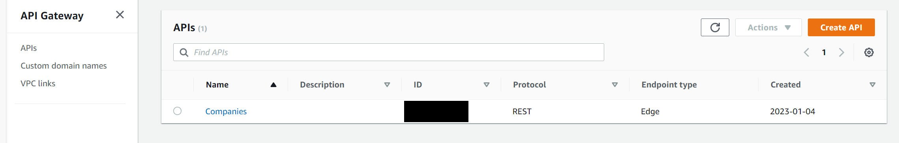
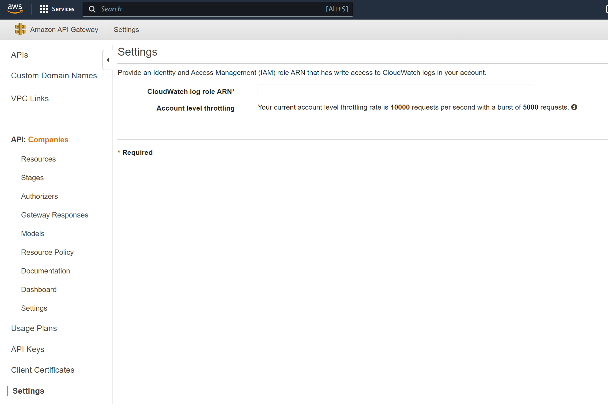
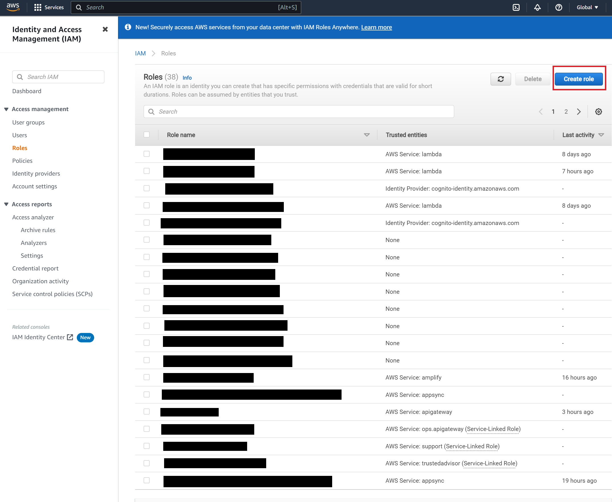
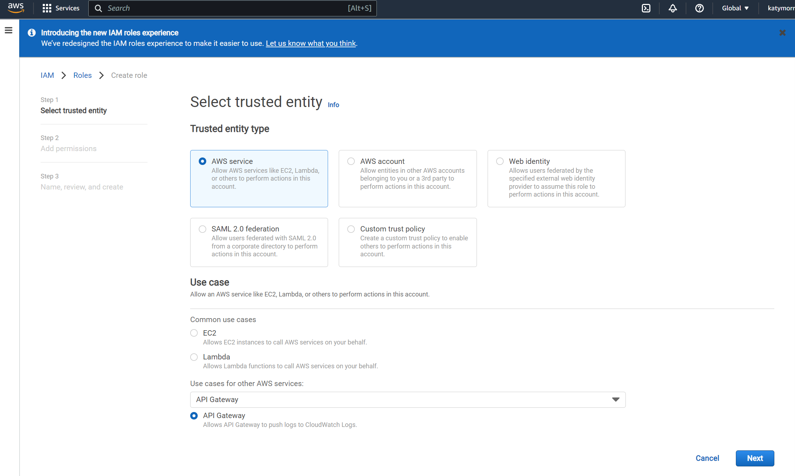
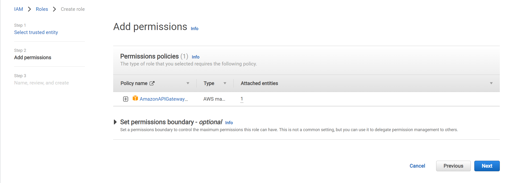
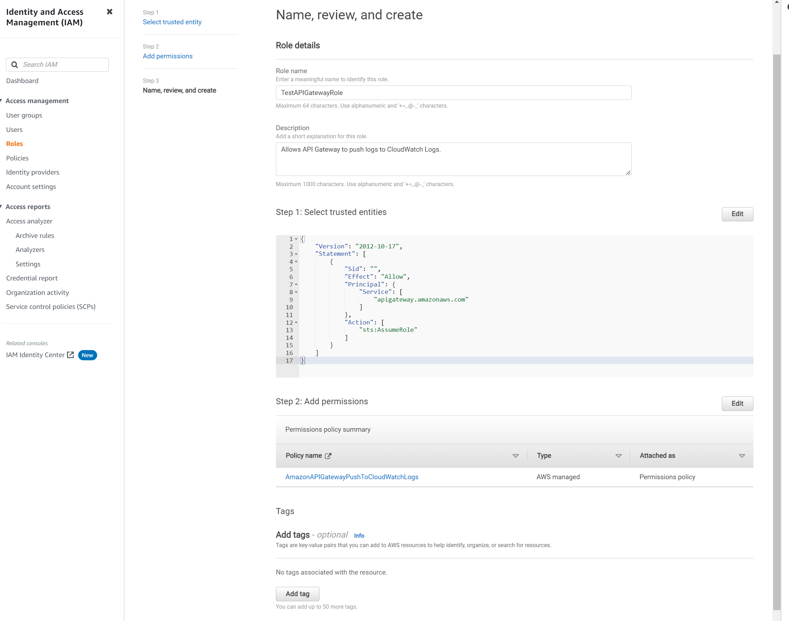
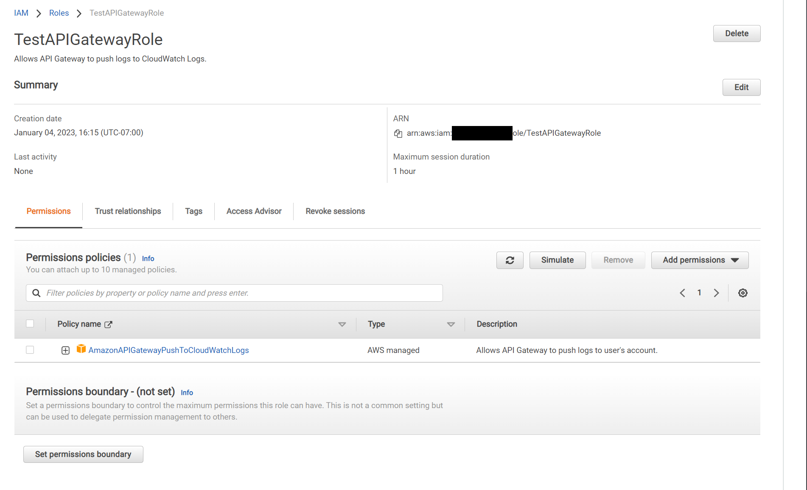
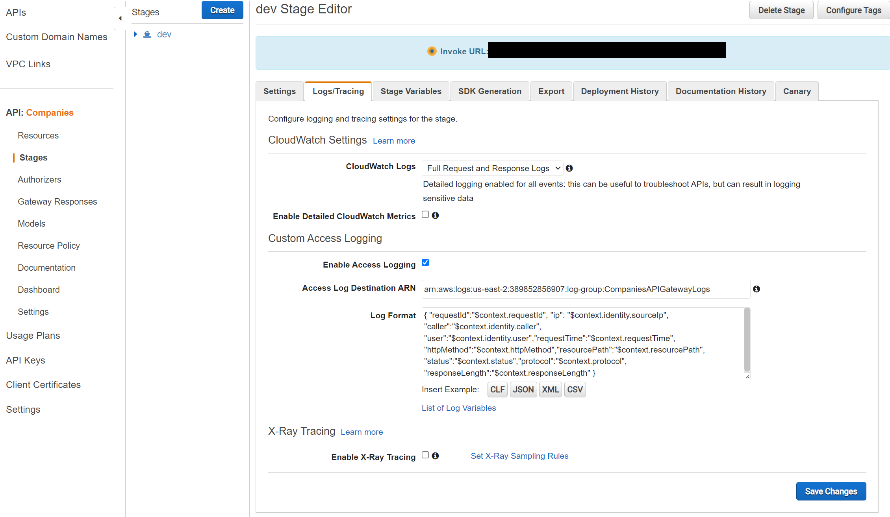

Working with AWS is new for me at the moment. Generally it's been pretty easy - a lot easier than Azure. But I'm definitely hitting quite a few knowledge blocks along the way. One thing that threw me off today was that, I was trying my first API call from the browser, trying to trigger my Lambda function, but it wasn't hitting it. My function logs were not showing any activity - so I needed to check the logs for the API Gateway. When I checked CloudWatch I noticed there was no log group for API Gateway, which seemed to be setup automatically for my Lambda functions. So I poked around and this is the process that I figured out to make this happen:

1. Navigate to your API list in API Gateway. Choose the API you want to have logs outputted.

2. On the left panel go to the bottom and choose Settings. In there you will see an input field labeled "CloudWatch log role ARN". You'll need to create a new role in Identity Access Management (IAM) to get the ARN to put in here. 

3. Keep this page open and duplicate the tab. In the new tab pull up Identity Access Management. On the top right click the "New Role" button.

4. The first step to creating a role that will allow for the logs from API Gateway to be written to CloudWatch is selecting the type of entity. Fortunately AWS makes this easy. Select "AWS service", then select the service the use case is for, "API Gateway". AWS then gives an option to choose a configuration that sets up a default policy to push logs to CloudWatch. 

5. Next, the setup will ask to set up permissions policies. You'll see there's one managed policy listed, this policy gives our role the permissions we need to push logs to CloudWatch. You don't need to change anything here, so click "Next".

6. Last step for creating the role is naming and reviewing the info. Add a role name that makes sense for you. You shouldn't need to adjust any of the trusted entities JSON or permissions. Click "Create Role" on the bottom right. You should be able to see your role in the roles list now (if not, reload the page). 

7. Click and open your new role to view the summary info. On the far right under "Summary", you will see the ARN we need to input on the API Gateway page. Copy this to your clipboard.

8. Return to your API Gateway tab and paste the ARN into the blank input field. Click save. If you received no indicated that it worked, it worked (thanks AWS). If not, you should get an error. 

9. Now that you have your roles done, the next thing to do is to enable logs in your env. Go to your navigation panel on the left and click on "Stages". This will reveal the different environments you have set up for your API. Click on the environment you want to see logs for and a settings page will show. Choose the "Logs/Tracing" tab in the settings page and you will see the the configurations for enabling logging.

Here, you can use the dropdown menu for "CloudWatch Logs" to choose the type of logs you want to see. 

