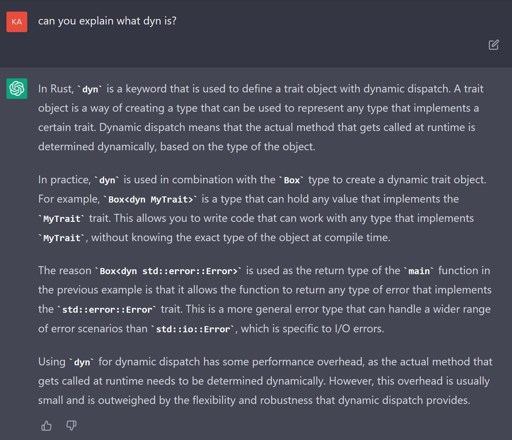
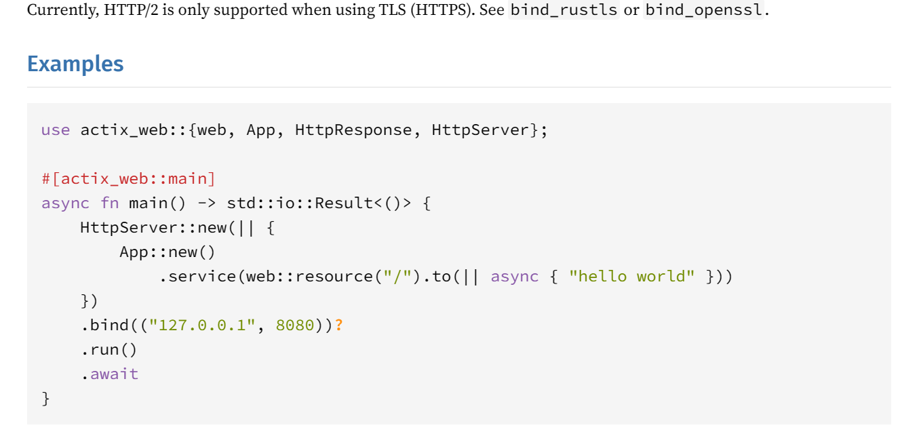

ChatGPT has been my programming friend lately. In the 7 or so years I've been a Software Engineer, I've generally not been a fan of the learning process of new technology. Don't get me wrong, I love learning and expanding my skillset - but the grueling part of going through a tutorial where you watch someone code, sometimes follow along and copy them, build a fake, simple project, read through documentation and try to find the exact piece you need sometimes can take a lot of time. Plus many times, tutorials like these are aimed at beginners and a lot of the material is extremely repetitive. Generally I end up watching about half of a course then drop it and just go try to build something on my own and reference back when I need to. It can be exciting but sometimes frustrating when things don't work exactly how you want - but you don't know why because you just generally don't have that experience yet, but are tired of going through the tutorial process and just want to get building. 

This is where ChatGPT has been a great bridge for me lately when working on my first extensive React project. I had some basic familiarity with React (from video tutorials and building small projects) but had never designed and built a program from scratch. I did the thing again where I went back and watched about half of an Udemy course to get a refresher and then started my project. I started having ChatGPT open on a tab and would ask it basic questions and tasks - what function do I use to check prop updates? Build me a simple class component that contains a form, convert this class component to a functional component, my syntax is wrong, please debug it, etc. I found by using ChatGPT as a copilot, I've been able to build andd learn much quicker than if I was going through the traditional stack overflow searches.

I've been doing this for about a couple months now, and it got me thinking. If I can get over the hurdles of learning the ins and outs of a familiarish framework like React, can ChatGPT get me through creating a project in a completely new language? This felt like a bit of a stretch, considering with React I'm already extremely familiar with JavaScript and can debug issues pretty quickly without ChatGPT. But it left me wondering... how much further do we need to go where developers are no longer confined by the languages they're familiar with?

I decided to test this and see if ChatGPT can teach me something I'm 100% unfamiliar with - Rust. I hear a lot on Rust, never tried it. I'm also less familiar with backend languages outside of Node and Ruby. I figured it would be a pretty good test to see if ChatGPT can get me building a Rust application quickly. I wanted to do my best to stay in ChatGPT rather than searching stackoverflow for answers, just to test the capabilities of ChatGPT.

It was a bit early in the day when I started so I decided to push ChatGPT a bit to help me figure out what to build.

Then I asked it for a list of project for newbies - it gave me the standard stuff like a calculator, password generator, and a weather app. So I asked it to help me build a weather app since it would include an API call - might be a bit more interesting. 

I'm not sure what I was expecting here, maybe not the entire code - but I guess it makes sense it just gave me all of the code for a starter project. It gave me what it thinks is the code and process to build the entire application. 

First it had me add some dependencies in the Cargo.toml file for fetching data, then it gave me some code to put in the main.rs file. I took it as is and ran it like it said, that's when I hit my first error:

I asked ChatGPT about the error and it told me that the "main" function cannot be marked as async, because "the 'main' function in Rust is not allowed to be marked as 'async'. 

I didn't know what tokio runtime was, so I asked and it seemed to give a good definition: 

Bummer it didn't see the error when originally outputting, but good for learning I guess. I suppose it's the same mistakes I'd be making myself. But in an AI, I'd want it to be more accurate if I wasn't a newbie Rust developer.

I input the new code and tried to run it:

Well dangit. I asked it how to declare the module:

Great. I added the code to Cargo.toml and ran cargo build, it built with no errors and everything looked good. Ran cargo run again and yay!:

Nice! Got my first Rust app up and running. A few errors along the way, but not bad. But I wanted to push ChatGPT a little bit further, so I wanted to see if it could help me make this into an endpoint I can hit locally:

Looks simple enough... but I knew better this time and asked it if I need to install any new modules:

Installed what it said, ran cargo build and tried it out.

From the looks of it the version I installed isn't compatible with the version of Rust I used to generate my app. Since ChatGPT runs off of data that's a couple years old, I assume that's where the error is. I changed the version to 4.3.1 and ran cargo build again:

I didn't notice it when I pasted in the new code for the endpoint but it had switched back to using the async in the 'main' function rather than tokio runtime, which is now giving me the same error I had when we were initially building it. Bummer it didn't remember the error and when generating new code. I gave it a prompt to "Please correct the code and validate that any future code does not output this error." Hopefully that helps. It gave me corrected code using the actix-web runtime.

Then I wondered why it wasn't using tokio anymore, so I asked it:

That reasoning makes sense. Tokio's purpose isn't for building web servers, but actix-web is actually built on top of tokio. I was happy with the explanation it gave me. 

I tried the new code, and behold:

A warning and an error. Warning is an easy fix, remove the "web" import. It makes some sense that Chatgpt didn't catch that would cause an error, in it's data it probably ranks that import snippet as highly used so it gave it to me. It didn't check it against the other code in the script it gave me to see if "web" is actually used. Small change though, not a big deal.

I ran the warning and error through ChatGPT and it gave me this response:

It's saying the warning isn't a big deal, which it's right - it's not. But best practice would be to remove the 'web' module anyway.

For the mismatch error it's suggesting I change the return type to a more general type rather than using a specific type. The difference would be these:

Original:  `Result<(), std::io::Error>`
Newly Suggested:  `Result<(), Box<dyn std::error::Error>>`

In my head I'm wondering if `Box<dyn>` might be equivilent to "any" in TypeScript. You generally want to avoid using general types so errors can be caught more accurately, so I'm questioning whether ChatGPT is correct here. I asked it to explain `Box<dyn>`:

I'm still questioning the accuracy of ChatGPT using `Box<dyn>` in this situation. I decided it's time to venture outward to Google at this point out of curiousity. I ended up at the Rust documentation:

I found this answer much better than what ChatGPT gave me. Then I started looking for an example of actix HttpServer to compare what ChatGPT gave me to it. I went to the documentation again and found this snippet which doesn't use `Box<dyn>`:

I read it over, copied it over and replaced the ChatGPT snippet I was given, changed it to use my get_weather function and it worked!

I admit that I jumped forward a bit here and didn't follow my original purpose to use ChatGPT as much as possible for solutions. I didn't even try ChatGPT's suggestion of using `Box<dyn>`, so I figured I'd try it to see if it would have worked in the first place, and no - it didn't:

At this point I've finished my coffee and breakfast and want to move on with my day, so I decided to not continue trying to get ChatGPT to give me working code. I've gone through 2 phases of a small application build and it was an interesting process.

I definitely had a few questions following this, so I decided to explore the differences between the ChatGPT code and the documentation code a bit more. 

I found it interesting that I was able to use 'async' on my main function using the documentation example vs ChatGPT and I noticed the big difference in the two code snippets was the use of #[actix_web::main] above the main function in the documentation code. I looked into what this does and found out it allows HttpServer to run asycronously. It sets up the tokio runtime and runs the server on a separate thread, allowing other asynchronous tasks to run concurrently. I found this is a best practice to use actix_web this way. 

I wonder if I had pushed ChatGPT further to give me working code if it would have caught the absence of this and eventually given it to me. Based on the first rewrite of the HttpServer code and my previous experience with using ChatGPT, I think it would have continued to generate wrong code unless I was able to ask it the correct questions - which I didn't know, because I'm a Rust newbie. 

In the end, this short test leaves me with the same ongoing thoughts on ChatGPT, GPT3 and GPT4 - it's not going to replace developers or reliabily teach new programming concepts. Definitely use it, but use it with caution and in conjuction with documentation and stack overflow. If you're familiar with the language you're using GPT with, then you're probably ok to use with caution. Using with new languages may also be fine, but be prepared to extensively research definitions, vulnerbilities, best practices and debugging solutions. If I were to seriously learn Rust, I would probably go through my normal process to do an Udemy course rather than continue this ChatGPT path. By using ChatGPT only I would be missing out on concepts like overall design practices, particular Rust quirks, and concepts that relate directly to eachother and assist in understanding it as a whole.

Using AI as a developer co-pilot has been the biggest increase in productivity for me and other developers and should be utilized rather than feared. It's a great tool that makes the developer process more enjoyable and it's a peak into the future where developers can enjoy doing more creating rather than heavy debugging. 

In the end, AI won't be taking developer jobs anytime soon - and I would suggest coding newbies to avoid using ChatGPT at all costs - it's important to understand the underlying concepts in depth before using this tool.

